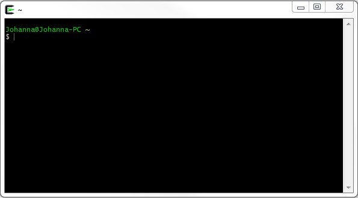
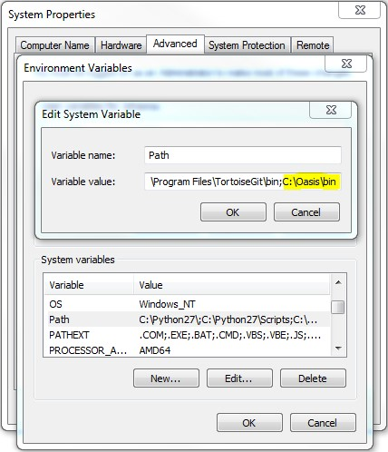

# ktools

This is the POSIX-compliant Oasis In-Memory Kernel toolkit.

### Release

Please click [here](https://github.com/OasisLMF/ktools/releases) to download the latest release. 

The source code will change on a regular basis but only the releases are supported. Support enquiries should be sent to support@oasislmf.org.

There are build instructions for Windows 64-bit executables. 

Note that the dynamic random number option in the Windows build uses a deterministic seed due to a bug in the mingw compiler. We recommend the random number file option (gulcalc -r) should be used in Windows. 

This issue will be handled in future releases by implementing the rdrand random number generator in all environments.

## Linux Installation

### Pre-requisites

The g++ compiler build-essential, libtool, zlib1g-dev on debian distros or 'Development Tools' and zlib-devel on red hat  needs to be installed in Linux.

### Instructions

Copy ktools-[version].tar.gz onto your machine and untar.
``` sh
$ tar -xvf ktools-[version].tar.gz
```

Go into the ktools folder and  autogen using the following command;
``` sh
$ cd ktools-[version]
$ ./autogen.sh
```

Configure using the following command;
``` sh
$ ./configure
```

Make using the following command;
``` sh
$ make
```

Next run the automated test to check the build and numerical results;
``` sh
$ make check
```

Finally, install the executables using the following command;
``` sh
$ [sudo] make install
```

The installation is complete. The executables are located in /usr/local/bin. 

If installing the latest code from the git repository, clone the ktools repository onto your machine.

Go into the ktools folder and  autogen using the following command;
``` sh
$ cd ktools
$ ./autogen.sh
```


Follow the rest of the process as described above.

## Windows Installation

### Pre-requisites
Cygwin 64-bit is required for the Windows native build.  Cygwin is a Linux environment running in Windows.
http://www.cygwin.com/

Download and run the set-up program for Cygwin. 
The following Cygwin add-in packages are required;
* gcc-g++
* gcc-core
* make
* diffutils
* automake
* libtools
* zlib-devel
* git


To build native Windows 64-bit executables;

* mingw64-x86_64-gcc-g++
* mingw64-x86_64-gcc-core
* mingw64-x86_64-zlib

Search for 'mingw', gcc', 'make' and 'diffutils' to find all of the relevant packages (Only 'gcc' illustrated below).


### Instructions

Copy ktools-[version].tar.gz onto your machine. 

Open a Cygwin terminal. 



Change directory to the location of the tar.gz.

Extract the files using the following command
``` sh
$ tar -xvf ktools-[version].tar.gz
```

Go into the ktools folder and autgen using the following command;

``` sh
$ cd ktools-[version]
$ ./autogen.sh
```

Configure using the following command;
``` sh
$ ./winconfigure
```

Make using the following command;
``` sh
$ make
```

Next run the automated test to check the build and numerical results;
``` sh
$ make check
```

Finally, install the executables using the following command;
``` sh
$ make install
```

The executables are located in C:/Oasis/bin. You should add this bin folder to your path in System Environment Variables.



The installation is complete. Restart the Cygwin session to refresh the path before usage.

## Usage

There is sample data and six example scripts which demonstrate how to invoke ktools in the /examples folder. These are written in python v2. 

For example, to run the eltcalc_example script, go into the examples folder and run the following command (you must have python v2.X installed):

``` sh
$ cd examples
$ python eltcalc_example.py 
```

To build linux docker image do following command

```
docker build --file Dockerfile.ktools.alpine -t alpine-ktools .
```


### Questions/problems?

Email support@oasislmf.org
