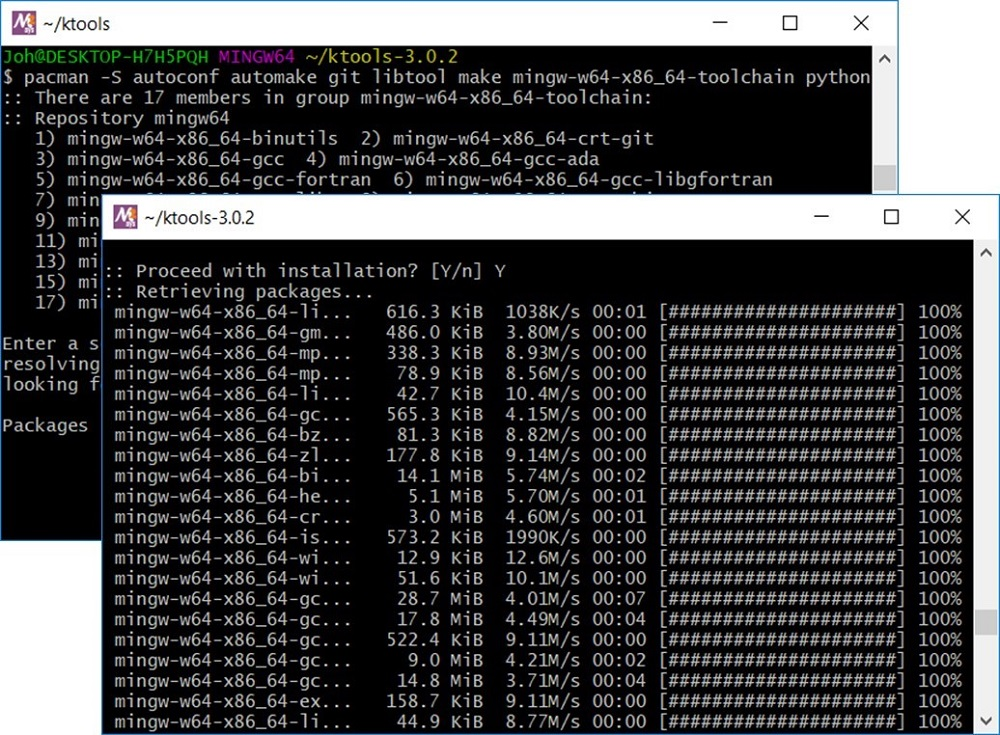

 [](https://github.com/OasisLMF/ktools/releases)
 [](https://travis-ci.com/OasisLMF/ktools)
[](https://ci.oasislmfdev.org/job/oasis_ktools/job/master/)

# ktools

This is the POSIX-compliant Oasis LMF In-Memory Kernel toolkit.

### Release

Please click [here](https://github.com/OasisLMF/ktools/releases) to download the latest release. 

The source code will change on a regular basis but only the releases are supported. Support enquiries should be sent to support@oasislmf.org.

There are build instructions for Windows 64-bit executables. 

Note that the dynamic random number option in the Windows build uses a deterministic seed due to a bug in the mingw compiler. We recommend the random number file option (gulcalc -r) should be used in Windows. 

This issue will be handled in future releases by implementing the rdrand random number generator in all environments.

## Linux Installation

### Pre-requisites

The g++ compiler build-essential, libtool, zlib1g-dev autoconf on debian distros or 'Development Tools' and zlib-devel on red hat  needs to be installed in Linux.

### Instructions

Copy ktools-[version].tar.gz onto your machine and untar.
``` sh
$ tar -xvf ktools-[version].tar.gz
```

Go into the ktools folder and  autogen using the following command;
``` sh
$ cd ktools-[version]
$ ./autogen.sh
```

Configure using the following command;
``` sh
$ ./configure
```

On OS X add an extra flag:
``` sh
$ ./configure --enable-osx
```

Make using the following command;
``` sh
$ make
```

Next run the automated test to check the build and numerical results;
``` sh
$ make check
```

Finally, install the executables using the following command;
``` sh
$ [sudo] make install
```

The installation is complete. The executables are located in /usr/local/bin. 

If installing the latest code from the git repository, clone the ktools repository onto your machine.

Go into the ktools folder and  autogen using the following command;
``` sh
$ cd ktools
$ ./autogen.sh
```


Follow the rest of the process as described above.


### Cmake build - Experimental 

Install Cmake from either system packages or [cmake.org](https://cmake.org/download/).

``` sh
# create the build directory within ktools directory
$ mkdir build && cd build
$ ktools_source_dir=~/ktools
# Generate files and specify destination (here is in ./local/bin)
$ cmake -G "Unix Makefiles" -DCMAKE_BUILD_TYPE=Release -DCMAKE_INSTALL_PREFIX=~/.local $ktools_source_dir

# Build
$ make all test

# If all is OK, install to bin subdir of the specified install prefix
$ make install
```

## Windows Installation

### Pre-requisites
MSYS2 64-bit is required for the Windows native build.  MSYS2 is a Unix/Linux like development environment for building and distributing windows applications.
https://www.msys2.org/

Download and run the set-up program for MSYS2 64-bit. 

Open a MSYS2 terminal and perform the updates before continuing.

The following add-in packages are required;

* autoconf
* automake
* git
* libtool
* make
* mingw-w64-x86_64-toolchain
* python

These packages can be installed at the MSYS2 terminal command line.

``` sh
$ pacman -S autoconf automake git libtool make mingw-w64-x86_64-toolchain python
```


### Instructions

Clone the github repository at the MSYS2 terminal command line
``` sh
$ git clone https://github.com/OasisLMF/ktools.git
```

Go into the ktools folder and run autogen using the following command;
``` sh
$ cd ktools
$ ./autogen.sh
```

Configure using the following command;
``` sh
$ ./configure
```

Make using the following command;
``` sh
$ make
```

Next run the automated test to check the build and numerical results;
``` sh
$ make check
```

Finally, install the executables using the following command;
``` sh
$ make install
```

The installation is complete. The executables are located in /usr/local/bin. 

## Usage

There is sample data and six example scripts which demonstrate how to invoke ktools in the /examples folder. These are written in python v2. 

For example, to run the eltcalc_example script, go into the examples folder and run the following command (you must have python installed):

``` sh
$ cd examples
$ python eltcalc_example.py 
```

To build linux docker image do following command

```
docker build --file Dockerfile.ktools.alpine -t alpine-ktools .
```

## Questions/problems?

Email support@oasislmf.org

## License
The code in this project is licensed under BSD 3-clause license.
