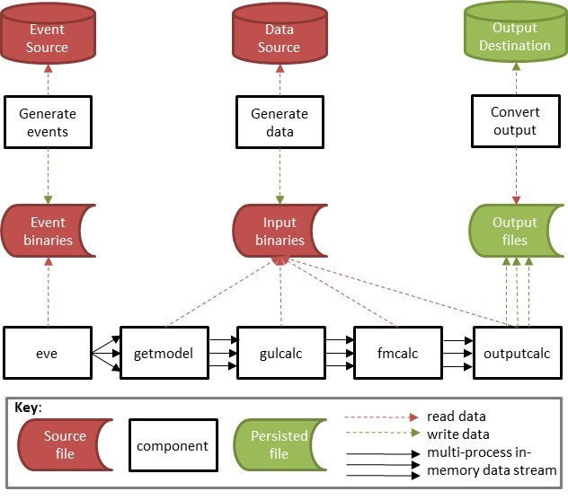
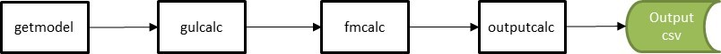
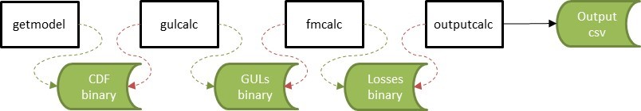

# Data Streaming Framework Overview

This is the general data streaming framework showing the main components of the toolkit.

##### Figure 1. Data streaming framework

The in-memory data streams are initiated by the process 'eve' (meaning 'event emitter' rather than in the biblical sense) and shown by solid arrows. The read/write data flows are shown as dashed arrows. Multiple arrows mean multiple processes. 

The calculation components are *getmodel*, *gulcalc*, *fmcalc* and *outputcalc*. Each has its own internal data requirements and in the reference model provided with this specification, and displayed in Figure 1, the internal data inputs come from the same source.  
However all components are plug-and-play, so the internal data for each can be retrieved from independent external sources. 

The standard workflow is straight through in-memory processing to produce a single output file.  This minimises the amount of disk I/O at each stage and results in the best performance. This workflow is shown in Figure 2.

##### Figure 2. Straight-through processing

However it is possible to write the results of each calculation to a binary file, if the data is required to be persisted. This workflow is shown in Figure 3.
At present, intermediate results binaries are required to be read back into memory for downstream calculations.

##### Figure 3. Multiple output file processing

The reference model demonstrates an implementation of the principal calculation components, along with some data conversion components which convert binary files to csv files. 

[Go to Specification](Specification.md)

[Back to Contents](Contents.md)
