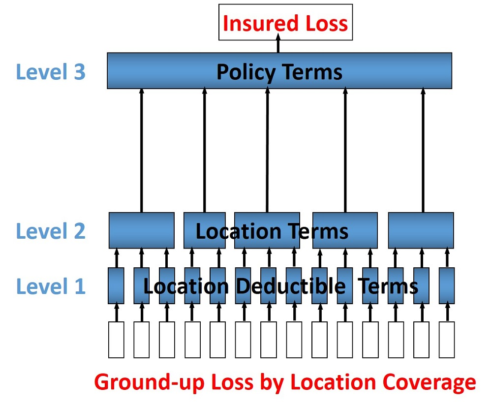
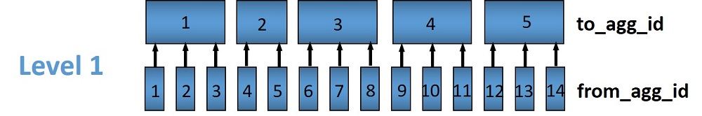
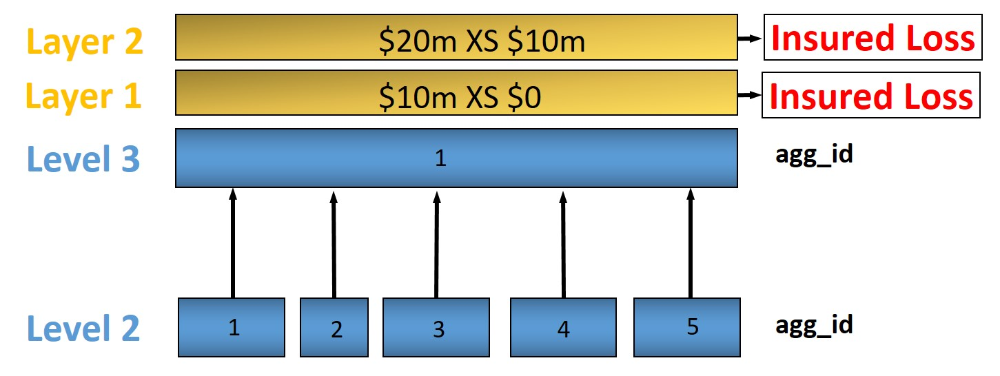

# Financial Module

The Oasis Financial Module is a data-driven process design for calculating the losses on (re)insurance contracts. It has an abstract design in order to cater for the many variations in contract structures and terms. The way Oasis works is to be fed data in order to execute calculations, so for the insurance calculations it needs to know the structure, parameters and calculation rules to be used. This data must be provided in the files used by the Oasis Financial Module:

* **fm_programme**: defines how coverages are grouped into accounts and programmes
* **fm_profile**: defines the layers and terms
* **fm_policytc**: defines the relationship of the contract layers

This section explains the design of the Financial Module which has been implemented in the **fmcalc** component. 
* Runtime parameters and usage instructions for fmcalc are covered in [Reference Model](ReferenceModel.md). 
* The formats of the input files are covered in [Input Data](Inputtools.md). 
 
In addition, there separate github repository [ktest](https://github.com/OasisLMF/ktest) which is an extended test suite for ktools and contains a library of financial module worked examples provided by Oasis Members with a full set of input and output files (access on request).

Note that other reference tables are referred to below that do not appear explicitly in the kernel as they are not directly required for calculation.  It is expected that a front end system will hold all of the exposure and policy data and generate the above three input files required for the kernel calculation.

## Scope

The Financial Module outputs sample by sample losses by (re)insurance contract, or by item, which represents the individual coverage subject to economic loss. In the latter case, it is necessary to ‘back-allocate’ losses when they are calculated at a higher policy level.  The Financial Module does not, at present, output retained loss or ultimate net loss (UNL) perspectives. It does, though, allow the user to output losses at any stage of the calculation.

The output contains anonymous keys representing the (re)insurance programme (prog_id) and policy (layer_id) at the chosen output level (output_id) and a loss value. Losses by sample number (idx) and event (event_id) are produced.  To make sense of the output, this output must be cross-referenced with Oasis dictionaries which contain the meaningful business information.

The Financial Module does not support multi-currency calculations, although currency identifiers are included in the definition of profiles (see below) as placeholders for this functionality in future.

## Profiles

Profiles are used throughout the Oasis framework and are meta-data definitions with their associated data types and rules.  Profiles are used in the Financial Module to perform the elements of financial calculations used to calculate losses to (re)insurance policies.  For anything other than the most simple policy which has a blanket deductible and limit, say, a profile do not represent a policy structure on its own, but rather is to be used as a building block which can be combined with other building blocks to model a particular financial contract. In this way it is possible to model an unlimited range of structures with a limited number of profiles.

The FM Profiles form an extensible library of calculations defined within the fmcalc code that can be invoked by specifying a particular **calcrule_id** and providing the required data values such as deductible and limit, as described below.

The Profiles currently supported are as follows;

#### Supported Profiles

| Profile description                                                | profile_id| calcrule_id |
|:-------------------------------------------------------------------|-----------|------------:|
| Deductible and limit                                               | 1         |   1         |
| Franchise deductible and limit                                     | 2         |   3         |
| Deductible only                                                    | 3         |  12         |
| Deductible as a cap on the retention of input losses               | 4         |  10         |
| Deductible as a floor on the retention of input losses             | 5         |  11         |
| Deductible, limit and share                                        | 6         |   2         |
| Deductible and limit as a proportion of loss                       | 10        |   5         |
| Limit with deductible as a proportion of limit                     | 11        |   9         |
| Limit only                                                         | 12        |   14        |
| Limit as a proportion of loss                                      | 13        |   15        |
| Deductible as a proportion of loss                                 | 14        |   16        |

See [FM Profiles](fmprofiles.md) for more details. 

## Design

The Oasis Financial Module is a data-driven process design for calculating the losses on insurance policies. Like the Exposure Module, it is an abstract design in order to cater for the many variations and has three basic concepts:

1. A **programme** which defines which **items** are grouped together at which levels for the purpose of providing loss amounts to policy terms and conditions. The programme has a user-definable profile and dictionary called **prog** which holds optional reference details such as a description and account identifier. The prog table is not required for the calculation and therefore does not appear in the kernel input files.
2. A policytc **profile** which provides the parameters of the policy’s terms and conditions such as limit and deductible and calculation rules.
3. A **policytc** cross-reference file which associates a policy terms and conditions profile to each programme level aggregation.

The profile not only provides the fields to be used in calculating losses (such as limit and deductible) but also which mathematical calculation (calcrule_id) and which allocation rule (allocrule_id) to apply.

## Data requirements

The Financial Module brings together three elements in order to undertake a calculation:
* Structural information, notably which items are covered by a set of policies.
* Loss values of items.
* Policy profiles and profile values.

There are many ways an insurance loss can be calculated with many different terms and conditions. For instance, there may be deductibles applied to each element of coverage (e.g. a buildings damage deductible), some site-specific deductibles or limits, and some overall policy deductibles and limits and share. To undertake the calculation in the correct order and using the correct items (and their values) the structure and sequence of calculations must be defined. This is done in the **programme** file which defines a heirarchy of groups across a number of **levels**.  Levels drive the sequence of calculation. A financial calculation is performed at successive levels, depending on the structure of policy terms and conditions. For example there might be 3 levels representing coverage, site and policy terms and conditions. 

#### Figure 1. Example 3-level programme hierarchy

Groups are defined within levels and they represent aggregations of losses on which to perform the financial calculations.  The grouping fields are called from_agg_id and to_agg_id which represent a grouping of losses at the previous level and the present level of the hierarchy, respectively.  

#### Figure 2. Example level 1 grouping

### Loss values
The initial input is the ground-up loss (GUL) table, generally coming from the main Oasis calculation of ground-up losses. Here is an example, for a two events and 1 sample (idx=1):

| event_id | item_id  | idx    | gul    |
|:---------|----------|--------| ------:|
|       1  | 1        |    1   | 100,000|
|       1  | 2        |    1   | 10,000 |
|       1  | 3        |    1   | 2,500  |
|       1  | 4        |    1   | 400    |
|       2  | 1        |    1   | 90,000 |
|       2  | 2        |    1   | 15,000 |
|       2  | 3        |    1   | 3,000  |
|       2  | 4        |    1   | 500    |

The values represent a single ground-up loss sample for items belonging to an account. We use “programme” rather than "account" as it is more general characteristic of a client’s exposure protection needs and allows a client to have multiple programmes active for a given period.
The linkage between account and programme can be provided by a user defined **prog** dictionary, for example;

| prog_id  | account_id  | prog_name                     |
|:---------|-------------|------------------------------:|
|       1  | 1           | ABC Insurance Co. 2016 renewal|

Items 1-4 represent Structure, Other Structure, Contents and Time Element coverage ground up losses for a single property, respectively, and this example is a simple residential policy with combined property coverage terms. For this policy type, the Structure, Other Structure and Contents losses are aggregated, and a deductible and limit is applied to the total. A separate set of terms, again a simple deductible and limit, is applied to the “time element” coverage which, for residential policies, generally means costs for temporary accommodation. The total insured loss is the sum of the output from the combined property terms and the time element terms.

### Programme

The actual items falling into the programme are specified in the **programme** table together with the aggregation groupings that go into a given level calculation:

| prog_id  | from_agg_id | level_id| to_agg_id |
|:---------|-------------|---------| ---------:|
|       1  | 1           |     1   | 1         |
|       1  | 2           |     1   | 1         |
|       1  | 3           |     1   | 1         |
|       1  | 4           |     1   | 2         |
|       1  | 1           |     2   | 1         |
|       1  | 2           |     2   | 1         |

Note that from_agg_id for level_id=1 is equal to the item_id in the input loss table (but in theory from_agg_id could represent a higher level of grouping, if required). 

In level 1, items 1, 2 and 3 all have to_agg_id =1 so losses will be summed together before applying the combined deductible and limit, but item 4 (time) will be treated separately (not aggregated) as it has to_agg_id = 2. For level 2 we have all 4 items losses (now represented by two groups from_agg_id =1 and 2 from the previous level) aggregated together as they have the same to_agg_id = 1.

### Profile

Next we have the profile description table, which list the profiles representing general policy types. Our example is represented by two general profiles which specify the input fields and mathematical operations to perform. In this example, the profile for the combined coverages and time is the same (albeit with different values) and requires a limit, a deductible, and an associated calculation rule, whereas the profile for the policy requires a limit, deductible, and share, and an associated calculation rule.

| Profile description                                                | profile_id| calcrule_id |
|:-------------------------------------------------------------------|-----------|------------:|
| Deductible and limit                                               | 1         |   1         |
| Deductible, limit and share                                        | 6         |   2         |

There is a “profile value” table for each profile containing the applicable policy terms, each identified by a policytc_id. The table below shows the list of policy terms for profile_id 1.

| policytc_id | ccy_id | limit     | deductible   |
|:------------|--------|-----------| -------------|
|       1     | 1      | 1,000,000 | 1,000        |
|       2     | 1      |    18,000 | 2,000        |

And next, for profile 6, the values for the overall policy deductible, limit and share

| policytc_id | ccy_id | limit     | deductible   | share_prop_of_lim  | 
|:------------|--------|-----------| -------------|--------------------|
|       3     | 1      | 1,000,000 | 1,000        |    0.1             |

In practice, all profile values are stored in a single flattened format which contains all supported profile fields, but conceptually they belong in separate profile value tables (see fm profile in [Input tools](Inputtools.md)).

For any given profile we have four standard rules:
* **calcrule_id**, being the Function used to calculate the losses from the given Profile’s fields. More information about the functions can be found in [FM Profiles](fmprofiles.md).
* **allocrule_id**, being the rule for allocating back to ITEM level. There are really only two meaningful values here – don’t allocate (0) used typically for the final level to avoid maintaining lots of detailed losses, or allocate back to ITEMs (1) used in all other cases which is in proportion to the input ground up losses.
(Allocation does not need to be on this basis, by the way, there could be other rules such as allocate back always on TIV or in proportion to the input losses from the previous level, but we have implemented a ground up loss back-allocation rule.
* **sourcerule_id** (not currently used), which is used for conditional logic if TIV (for example) needs to be used in a calculation.
* **levelrule_id** (not currently used) used for processing level-specific rules such as “special conditions”.

### Policytc
The **policytc** table specifies the insurance policies (a policy in Oasis FM is a combination of prog_id and layer_id) and the separate terms and conditions which will be applied to each layer_id/agg_id for a given level. In our example, we have a limit and deductible with the same value applicable to the combination of the first three items, a limit and deductible for the fourth item (time) in level 1, and then a limit, deductible, and line applicable at level 2 covering all items. We’d represent this in terms of the distinct agg_ids as follows:

| prog_id | layer_id | level_id | agg_id   | policytc_id |
|:--------|----------|----------| ---------|------------:|
|    1    |    1     |     1    |    1     |    1        |
|    1    |    1     |     1    |    2     |    2        |
|    1    |    1     |     2    |    1     |    3        |

In words, the data in the table mean;

At Level 1;

Apply policytc_id (calculation rule) 1 to (the sum of losses represented by) agg_id 1

Apply policy 2 to agg_id 2

Then at level 2;

Apply policytc_id 3 to agg_id 1

Levels are processed in ascending order and the calculated losses from a previous level are summed according to the groupings defined in the programme table which become the input losses to the next level.

#### Layers
Layers can be used to model multiple sets of terms and conditions applied to the same losses, such as excess policies. For the lower level calculations and in the general case where there is a single contract, layer_id should be set to 1. For a given level_id and agg_id, multiple layers can be defined by setting layer_id =1,2,3 etc, and assigning a different calculation policytc_id to each.

#### Figure 3. Example of multiple layers

For this example at level 3, the policytc data might look as follows;

| prog_id | layer_id | level_id | agg_id   | policytc_id |
|:--------|----------|----------| ---------|------------:|
|    1    |    1     |     3    |    1     |    22       |
|    1    |    2     |     3    |    1     |    23       |

## Outputs and back-allocation

Losses are output by event, programme, layer, output level and sample.  The table looks like this;

| event_id|  prog_id | layer_id | output_id| sidx  |  loss    |
|:--------|----------|----------| ---------|-------|---------:|
|    1    |    1     |     1    |    1     |    1  |   455.24 |
|    2    |    1     |     1    |    1     |    1  |   345.6  |

The output_id represents some grouping of items, depending on what allocation rule is applied at the final level of calculation;
* If allocrule_id = 0 for all policytc_ids at the final level then output_id = agg_id of the final level
* If allocrule_id = 1 for all policytc_ids at the final level then output_id = from_agg_id of the first level.

In other words, losses are either output at the contract level or back-allocated to the lowest level, which is item_id. To avoid unnecessary computation, it is recommended not to back-allocate unless losses are required to be reported at a more detailed level than the contract level (site or zip code, for example). In this case, losses are re-aggregated up from item level in a separate output module, using an item_id to summary level cross reference table.

In R1.1 of Oasis we took the view that it was simpler throughout to refer back to the base items rather than use a hierarchy of aggregated loss calculations. So, for example, we could have calculated a loss at the site level and then used this calculated loss directly at the policy conditions level but instead we allocated back to item level and then re-aggregated to the next level. The reason for this was that intermediate conditions may only apply to certain items so if we didn’t go back to the base item “ground-up” level then any higher level could have a complicated grouping of a level. 

In the implementation this required back-allocating losses to item at every level in a multi-level calculation even the next level calculaton did not require it, which was inefficient.   The aggregations are now defined in terms of the previous level groupings (from_agg_id in the programme table, rather than item_id) and the execution path now only supports simple hierarchies.

[Go to FM profiles](fmprofiles.md)

[Back to Contents](Contents.md)
