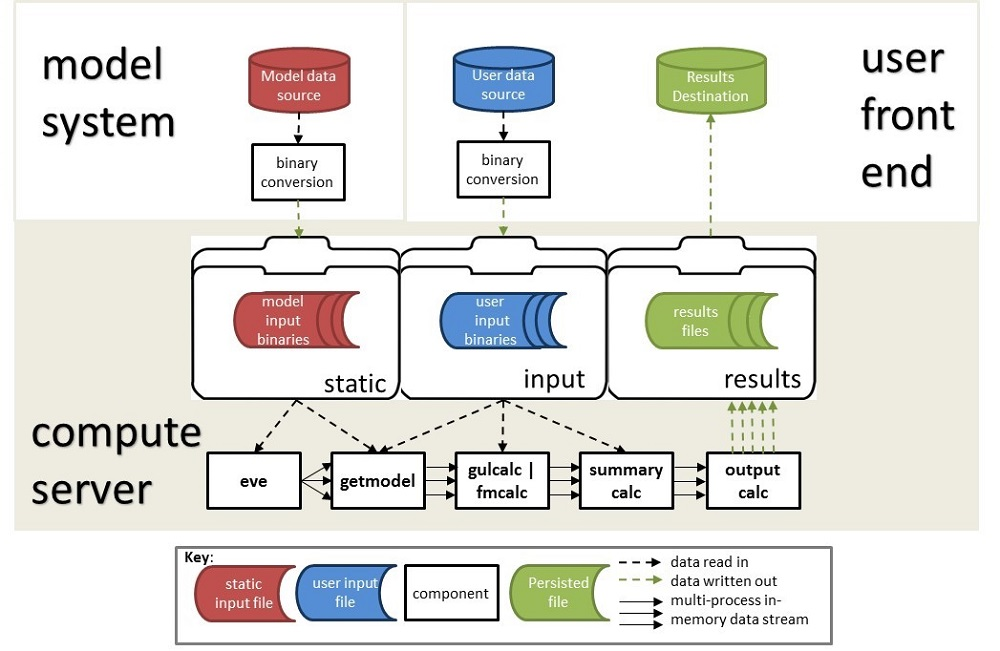

# 2. Data Streaming Framework Overview

This is the general data streaming framework showing the core components of the toolkit.

##### Figure 1. Data streaming framework

The architecture consists of;

* A **model system** which provides the model data in the correct binary format.  This is a one time set-up task.
* A **user front end**, which provides the users data for an analysis against the model.
* A **compute server**, where the computations are performed. The required model data is held in a 'static' folder, and the required user data is held in an 'input' folder.

The conversion of input data to binary format is shown in the diagram as occurring outside of the compute server, but this could be performed within the compute server. ktools provides a full set of binary conversion tools from csv input files which can be deployed elsewhere.

The in-memory data streams are initiated by the process 'eve' (meaning 'event emitter') and shown by solid arrows. The read/write data flows are shown as dashed arrows. 

The calculation components are *getmodel*, *gulcalc*, *fmcalc*, *summarycalc* and *outputcalc*. The streamed data passes through the components in memory one event at a time and are written out to a results file on the compute server.  The user can then retrieve the results (csvs) and consume them in their BI system.

The reference model demonstrates an implementation of the core calculation components, along with the data conversion components which convert binary files to csv files. 

The analysis workflows are controlled by the user, not the toolkit, and they can be as simple or as complex as required.

The simplest workflow is single or parallel processing to produce a single result.  This minimises the amount of disk I/O at each stage in the calculation, which performs better than saving intermediate results to disk. This workflow is shown in Figure 2.

##### Figure 2. Single output processing

However it is possible to stream data from one process into to several processes, allowing the calculation of multiple outputs simultaneously, as shown in Figure 3.

##### Figure 3. Multiple output processing

For multi-output, multi-process workflows, Linux operating systems provide 'named pipes' which in-memory data streams can be diverted to and manipulated as if they were files, and 'tee' which sends a stream from one process into multiple processes.  This means the core calculation is not repeated for each output, as it would be if several single-output workflows were run. 

[Go to 3. Specification](Specification.md)

[Back to Contents](Contents.md)
