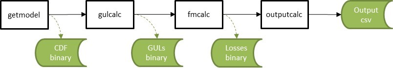

# Planned work

#### 1. Generate cdfs in getmodel
The cdf data is assumed to be pre-calculated and read into ktools from binaries.  This will be changed to calculate cdfs as part of getmodel from the model file inputs.

#### 2. Remove chunk concept from eve and getmodel
The input data for the reference components eve and getmodel can be split across several files, where each is identified by a chunk_id under a fixed naming convention. Eve and getmodel have 'chunk_id' as an input parameter which identifies the relevant input binary file. 

Because chunk is an Oasis mid-tier concept, the chunk parameter will be removed and each internal data input to the ktools reference model will be a single consolidated file.  

Note that the events can still be chunked and each chunk distributed to a separate back-end running the in-memory kernel.

#### 3. Multi-output workflows
Currently if the results of the intermediate calculation steps are required to be persisted, then they must be written out to disk and read back into memory to continue downstream processing.
##### Figure 1. Multiple output file processing - now

The plan is to enable intermediate calculation steps to be written out to disk whilst continuing the in-memory workflow.
##### Figure 2. Multiple output file processing - future

#### 4. Reduce sidx field from 4 bytes to 2 bytes
The sample index field is currently a 4 byte integer format for simplicity of design but we estimate gulcalc stdout data volumes could be reduced by approximately 25% if we reduce it to 2 bytes. This would mean a maximum number of samples of 64,000.

#### 5. Add random number limit as a parameter to gulcalc
There is a fixed limit of 1 million random numbers per event when the dynamic random number option (no -r parameter) is used in gulcalc. This limit was imposed to improve performance.  We plan to add this limit as an optional parameter to gulcalc.

#### 6. More outputs

More in-memory output components to calculate EP curves and event/year loss tables at different summary levels will be added.

[Go to Random numbers](RandomNumbers.md)

[Back to Contents](Contents.md)
