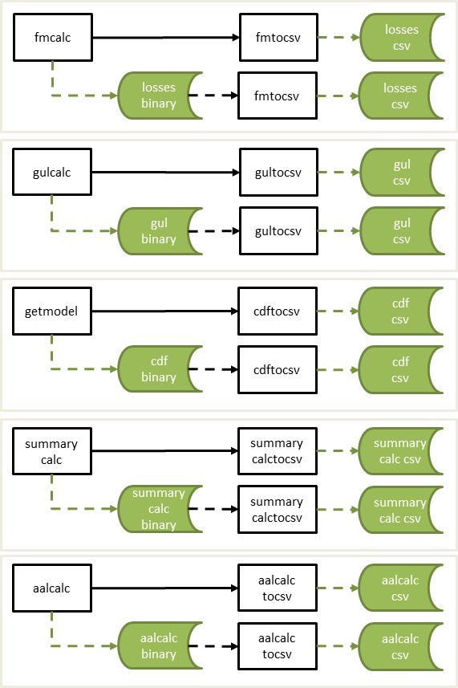
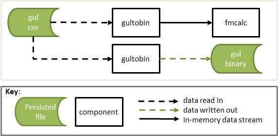

# 4.4 Stream conversion components <a id="streamconversioncomponents"></a>

The following components convert the binary output of each calculation component to csv format;
* **[cdftocsv](#cdftocsv)** is a utility to convert binary format CDFs to a csv. getmodel standard output can be streamed directly into cdftocsv, or a binary file of the same format can be piped in.
* **[gultocsv](#gultocsv)** is a utility to convert binary format GULs to a csv. gulcalc standard output can be streamed directly into gultocsv, or a binary file of the same format can be piped in.
* **[fmtocsv](#fmtocsv)** is a utility to convert binary format losses to a csv. fmcalc standard output can be streamed directly into fmtocsv, or a binary file of the same format can be piped in.
* **[summarycalctocsv](#summarycalctocsv)** is a utility to convert binary format summarycalc losses to a csv. summarycalc standard output can be streamed directly into summarycalctocsv, or a binary file of the same format can be piped in.
* **[aalcalctocsv](#aalcalctocsv)** is a utility to convert binary format aalcalc losses to a csv. aalcalc standard output can be streamed directly into aalcalctocsv, or a binary file of the same format can be piped in.

Additionally, the following component is provided to convert csv data into binary format;
* **[gultobin](#gultobin)** is a utility to convert gulcalc data in csv format into binary format such that it can be piped into fmcalc.

Figure 1 shows the workflows for the binary stream to csv conversions.

##### Figure 1. Stream conversion workflows


Figure 2 shows the workflows for the gultobin component.

##### Figure 2. gultobin workflows


<a id="cdftocsv"></a>
### cdftocsv 
***
A component which converts the getmodel output stream, or binary file with the same structure, to a csv file.

##### Stdin stream_id

| Byte 1 | Bytes 2-4 |  Description      |
|:-------|-----------|:------------------|
|    0   |     1     |  getmodel stdout  |

A binary file of the same format can be piped into cdftocsv.

##### Usage
```
$ [stdin component] | cdftocsv > [output].csv
$ cdftocsv < [stdin].bin > [output].csv
```

##### Example
```
$ eve 1 1 | getmodel | cdftocsv > cdf.csv
$ cdftocsv < getmodel.bin > cdf.csv 
```

##### Output
Csv file with the following fields;

| Name              | Type   |  Bytes | Description                                                         | Example     |
|:------------------|--------|--------| :-------------------------------------------------------------------|------------:|
| event_id          | int    |    4   | Oasis event_id                                                      |   4545      |
| areaperil_id      | int    |    4   | Oasis areaperil_id                                                  |  345456     |
| vulnerability_id  | int    |    4   | Oasis vulnerability_id                                              |   345       |
| bin_index         | int    |    4   | Damage bin index                                                    |    20       | 
| prob_to           | float  |    4   | The cumulative probability at the upper damage bin threshold        |   0.765     |
| bin_mean          | float  |    4   | The conditional mean of the damage bin                              |   0.45      |

[Return to top](#streamconversioncomponents)

<a id="gultocsv"></a>
### gultocsv 
***
A component which converts the gulcalc output stream, or binary file with the same structure, to a csv file.

##### Stdin stream_id

| Byte 1 | Bytes 2-4 |  Description             |
|:-------|-----------|:-------------------------|
|    1   |     1     |  gulcalc item stdout     |
|    1   |     2     |  gulcalc coverage stdout |

A binary file of the same format can be piped into gultocsv.

##### Usage
```
$ [stdin component] | gultocsv > [output].csv
$ gultocsv < [stdin].bin > [output].csv
```

##### Example
```
$ eve 1 1 | getmodel | gulcalc -r -S100 -c - | gultocsv > gulcalcc.csv
$ gultocsv < gulcalci.bin > gulcalci.csv 
```

##### Output
Csv file with the following fields;

gulcalc stream_id=1

| Name              | Type   |  Bytes | Description                                                         | Example     |
|:------------------|--------|--------| :-------------------------------------------------------------------|------------:|
| event_id          | int    |    4   | Oasis event_id                                                      |   4545      |
| item_id           | int    |    4   | Oasis item_id                                                       |    300      |
| sidx              | int    |    4   | Sample index                                                        |     10      |
| loss              | float  |    4   | The ground up loss value                                            | 5675.675    |

gulcalc stream_id=2

| Name              | Type   |  Bytes | Description                                                         | Example     |
|:------------------|--------|--------| :-------------------------------------------------------------------|------------:|
| event_id          | int    |    4   | Oasis event_id                                                      |   4545      |
| coverage_id       | int    |    4   | Oasis coverage_id                                                   |    150      |
| sidx              | int    |    4   | Sample index                                                        |     10      |
| loss              | float  |    4   | The ground up loss value                                            | 5675.675    |

[Return to top](#streamconversioncomponents)

<a id="fmtocsv"></a>
### fmtocsv 
***
A component which converts the fmcalc output stream, or binary file with the same structure, to a csv file.

##### Stdin stream_id

| Byte 1 | Bytes 2-4 |  Description      |
|:-------|-----------|:------------------|
|    2   |     1     |  fmcalc stdout    |

A binary file of the same format can be piped into fmtocsv.

##### Usage
```
$ [stdin component] | fmtocsv > [output].csv
$ fmtocsv < [stdin].bin > [output].csv
```

##### Example
```
$ eve 1 1 | getmodel | gulcalc -r -S100 -i - | fmcalc | fmtocsv > fmcalc.csv
$ fmtocsv < fmcalc.bin > fmcalc.csv 
```

##### Output
Csv file with the following fields;

| Name              | Type   |  Bytes | Description                                                         | Example     |
|:------------------|--------|--------| :-------------------------------------------------------------------|------------:|
| event_id          | int    |    4   | Oasis event_id                                                      |   4545      |
| output_id         | int    |    4   | Oasis output_id                                                     |    5        |
| sidx              | int    |    4   | Sample index                                                        |    10       |
| loss              | float  |    4   | The insured loss value                                              | 5375.675    |

[Return to top](#streamconversioncomponents)

<a id="summarycalctocsv"></a>
### summarycalctocsv 
***
A component which converts the summarycalc output stream, or binary file with the same structure, to a csv file.

##### Stdin stream_id

| Byte 1 | Bytes 2-4 |  Description           |
|:-------|-----------|:-----------------------|
|    3   |     1     |  summarycalc stdout    |

A binary file of the same format can be piped into summarycalctocsv.

##### Usage
```
$ [stdin component] | summarycalctocsv > [output].csv
$ summarycalctocsv < [stdin].bin > [output].csv
```

##### Example
```
$ eve 1 1 | getmodel | gulcalc -r -S100 -i - | fmcalc | summarycalc -f -1 - | summarycalctocsv > summarycalc.csv
$ summarycalctocsv < summarycalc.bin > summarycalc.csv 
```

##### Output
Csv file with the following fields;

| Name              | Type   |  Bytes | Description                                                         | Example     |
|:------------------|--------|--------| :-------------------------------------------------------------------|------------:|
| event_id          | int    |    4   | Oasis event_id                                                      |   4545      |
| summary_id        | int    |    4   | Oasis summary_id                                                    |    3        |
| sidx              | int    |    4   | Sample index                                                        |    10       |
| loss              | float  |    4   | The insured loss value                                              | 5375.675    |

[Return to top](#streamconversioncomponents)

<a id="aalcalctocsv"></a>
### aalcalctocsv 
***
A component which converts the aalcalc output stream, or binary file with the same structure, to a csv file.

##### Stdin stream_id

| Byte 1 | Bytes 2-4 |  Description           |
|:-------|-----------|:-----------------------|
|    4   |     1     |  aalcalc stdout        |

A binary file of the same format can be piped into aalcalctocsv.

##### Usage
```
$ [stdin component] | aalcalctocsv > [output].csv
$ aalcalctocsv < [stdin].bin > [output].csv
```

##### Example
```
$ eve 1 1 | getmodel | gulcalc -r -S100 -i - | fmcalc | summarycalc -f -1 - | aalcalc | aalcalctocsv > aalcalc.csv
$ aalcalctocsv < aalcalc.bin > aalcalc.csv 
```

##### Output
Csv file with the following fields;

| Name                | Type   |  Bytes | Description                                                         | Example     |
|:--------------------|--------|--------| :-------------------------------------------------------------------|------------:|
| summary_id          | int    |    4   | summary_id representing a grouping of losses                        |   10        |
| type                | int    |    4   | 1 for analytical mean, 2 for mean calculated from samples           |    1        |
| mean                | float  |    8   | sum of period mean losses                                           |    67856.9  |
| mean_squared        | float  |    8   | sum of squared period mean losses                                   |    546577.8 |
| max_exposure_value  | float  |    8   | maximum exposure value across all periods                           |    10098730 |

[Return to top](#streamconversioncomponents)

<a id="gultobin"></a>
### gultobin 
***
A component which converts gulcalc data in csv format into gulcalc binary standard output, for stream_id=1 (item stream).

##### Input file format

| Name              | Type   |  Bytes | Description                                                         | Example     |
|:------------------|--------|--------| :-------------------------------------------------------------------|------------:|
| event_id          | int    |    4   | Oasis event_id                                                      |   4545      |
| item_id           | int    |    4   | Oasis item_id                                                       |    300      |
| sidx              | int    |    4   | Sample index                                                        |     10      |
| loss              | float  |    4   | The ground up loss value                                            | 5675.675    |

* For each event_id and item_id combination, a record for sidx = -1 (mean) and sidx = -2 (standard deviation) must be included, even if the loss values are zero. 
* For each event_id and item_id combination, one or more sampled losses for sidx > 0 may be provided, but records for samples with zero loss may be omitted.

##### Parameters
-S, the number of samples must be provided.  This can be equal to or greater than maximum sample index value that appears in the csv data.

##### Usage
```
$ gultobin [parameters] < [input].csv | [stdin component]
$ gultobin [parameters] < [input].csv > [output].bin
```

##### Example
```
$ gultobin -S100 < gulcalci.csv | fmcalc > fmcalc.bin
$ gultobin -S100 < gulcalci.csv > gulcalci.bin
```

##### Stdout stream_id

| Byte 1 | Bytes 2-4 |  Description             |
|:-------|-----------|:-------------------------|
|    1   |     1     |  gulcalc item stdout     |

[Return to top](#streamconversioncomponents)

[Go to 5. Financial Module](FinancialModule.md)

[Back to Contents](Contents.md)

