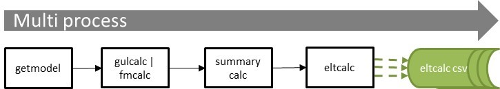
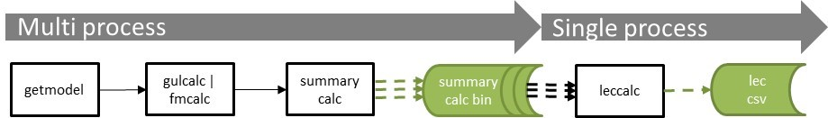
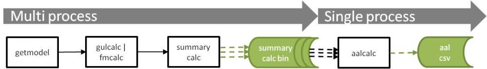
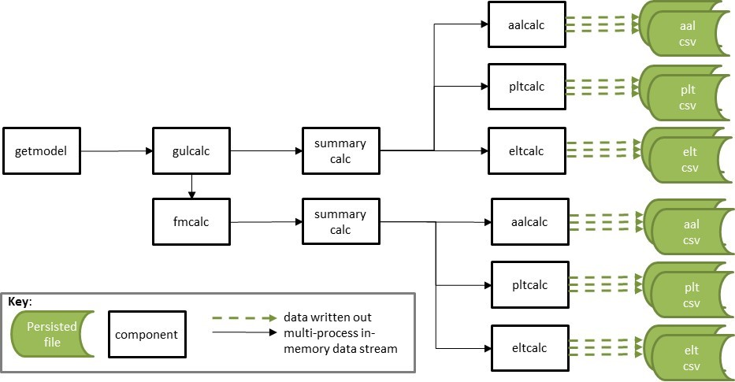
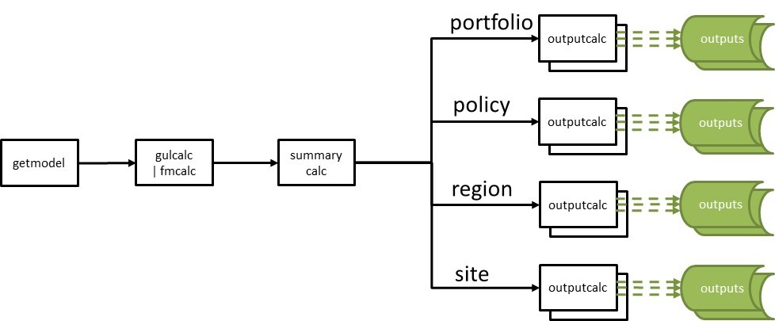

# 6. Workflows <a id="workflows"></a>

ktools is capable of multiple output workflows. This brings much greater flexibility, but also more complexity for users of the toolkit.  

This section presents some example workflows, starting with single output workflows and then moving onto more complex multi-output workflows. There are some python scripts provided which execute some of the illustrative workflows using the example data in the repository.  It is assumed that workflows will generally be run across multiple processes, with the number of processes being specified by the user.

### 1. Portfolio summary level insured loss event loss table

In this example, the core workflow is run through fmcalc into summarycalc and then the losses are summarized by summary set 2, which is "portfolio" summary level.
This produces multiple output files when run with multiple processes, each containing a subset of the event set.  The output files can be concatinated together at the end.
```
eve 1 2 | getmodel | gulcalc -r -S100 -i - | fmcalc | summarycalc -f -2 - | eltcalc > elt_p1.csv
eve 2 2 | getmodel | gulcalc -r -S100 -i - | fmcalc | summarycalc -f -2 - | eltcalc > elt_p2.csv
```

##### Figure 1. eltcalc workflow


See example script [eltcalc_example.py](../../examples/eltcalc_example.py)
***
### 2. Portfolio summary level insured loss period loss table

This is very similar to the first example, except the summary samples are run through pltcalc instead.  The output files can be concatinated together at the end.
```
eve 1 2 | getmodel | gulcalc -r -S100 -i - | fmcalc | summarycalc -f -2 - | pltcalc > plt_p1.csv
eve 2 2 | getmodel | gulcalc -r -S100 -i - | fmcalc | summarycalc -f -2 - | pltcalc > plt_p2.csv
```

##### Figure 2. pltcalc workflow


See example script [pltcalc_example.py](../../examples/eltcalc_example.py)
***
### 3. Portfolio summary level full uncertainty aggregate and occurrence loss exceedance curves

In this example, the summary samples are calculated as in the first two examples, but the results are output to the work folder.  Until this stage the calculation is run over multiple processes. Then, in a single process, leccalc reads the summarycalc binaries from the work folder and computes two loss exceedance curves in a single process. Note that you can output all eight loss exceedance curve variants in a single leccalc command.
```
eve 1 2 | getmodel | gulcalc -r -S100 -i - | fmcalc | summarycalc -f -2 - > work/summary2/p1.bin
eve 2 2 | getmodel | gulcalc -r -S100 -i - | fmcalc | summarycalc -f -2 - > work/summary2/p1.bin
leccalc -Ksummary2 -F lec_full_uncertainty_agg.csv -f lec_full_uncertainty_occ.csv
```

##### Figure 3. leccalc workflow


See example script [leccalc_example.py](../../examples/leccalc_example.py)
***
### 4. Portfolio summary level average annual loss

This time, the samples are run through to aalcalc, and the aalcalc binaries are output to the work folder.  Until this stage the calculation is run over multiple processes. Then, in a single process, aalsummary reads the aalcalc binaries from the work folder and computes the aal output. 
```
eve 1 2 | getmodel | gulcalc -r -S100 -i - | fmcalc | summarycalc -f -2 - | aalcalc > work/summary2/p1.bin
eve 2 2 | getmodel | gulcalc -r -S100 -i - | fmcalc | summarycalc -f -2 - | aalcalc > work/summary2/p2.bin
aalsummary -Ksummary2 > aal.csv
```

##### Figure 4. aalcalc workflow


See example script [aalcalc_example.py](../../examples/aalcalc_example.py)
***
## Multiple output workflows

### 5. Ground up and insured loss workflows
gulcalc can generate two output streams at once: item level samples to pipe into fmcalc, and coverage level samples to pipe into summarycalc. This means that outputs for both ground up loss and insured loss can be generated in one workflow.  
This is done by writing one stream to a file or named pipe, while streaming the other to standard output down the pipeline.

```
eve 1 2 | getmodel | gulcalc -r -S100 -i gulcalci1.bin -c - | summarycalc -g -2 - | eltcalc > gul_elt_p1.csv
eve 2 2 | getmodel | gulcalc -r -S100 -i gulcalci2.bin -c - | summarycalc -g -2 - | eltcalc > gul_elt_p2.csv
fmcalc < gulcalci1.bin | summarycalc -f -2 - | eltcalc > fm_elt_p1.csv
fmcalc < gulcalci2.bin | summarycalc -f -2 - | eltcalc > fm_elt_p2.csv
```
Note that the gulcalc item stream does not need to be written off to disk, as it can be sent to a 'named pipe', which keeps the data in-memory and kicks off a new process.  This is easy to do in Linux (but harder in Windows).

Figure 5 illustrates an example workflow.

##### Figure 5. Ground up and insured loss example workflow 


See example script [gulandfm_example.py](../../examples/gulandfm_example.py)
***
### 6. Multiple summary level workflows
Summarycalc is capable of summarizing samples to up to 10 different user-defined levels for ground up loss and insured loss. This means that different outputs can be run on different summary levels.  In this example, event loss tables for two different summary levels are generated.

```
eve 1 2 | getmodel | gulcalc -r -S100 -i - | fmcalc | summarycalc -f -1 s1/p1.bin -2 s2/p1.bin
eve 2 2 | getmodel | gulcalc -r -S100 -i - | fmcalc | summarycalc -f -1 s1/p2.bin -2 s2/p2.bin
eltcalc < s1/p1.bin > elt_s1_p1.csv
eltcalc < s1/p2.bin > elt_s1_p2.csv
eltcalc < s2/p1.bin > elt_s2_p1.csv
eltcalc < s2/p2.bin > elt_s2_p2.csv
```
Again, the summarycalc streams can be sent to named pipes rather than written off to disk.

Figure 6 illustrates multiple summary level streams, each of which can go to different output calculations.

##### Figure 6. Multiple summary level workflows 


[Return to top](#workflows)

[Go to Appendix A Random numbers](RandomNumbers.md)

[Back to Contents](Contents.md)

